# Projeto Fomulário de usuários

Aplicação gráfica feita em Java para cadastrar usuarios em um banco de dados

## 🚀 Começando

Consulte **[Implantação](#-implanta%C3%A7%C3%A3o)** para saber como implantar o projeto.

### 📋 Pré-requisitos

```
- Java SE 17+
- MySQL Workbench ou Xampp
- Driver de conexao MySql para JDBC
- NetBeans, Eclipse ou Intelllij
```
## 📦 Implantação

- Modelo feito utilizando NetBeans, caso tenha feito utilizando outra IDE, contate-nos para tirar duvidas...

## Passo-a-passo da criação de um arquivo Java

## 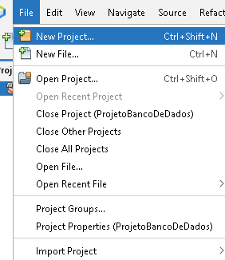

## 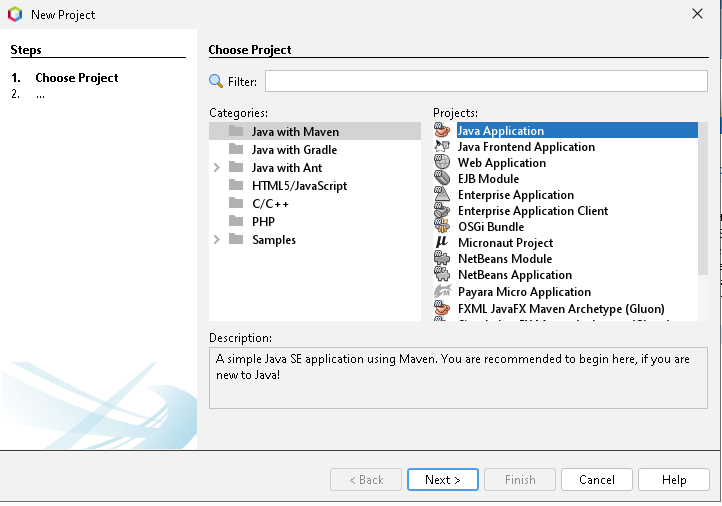

## 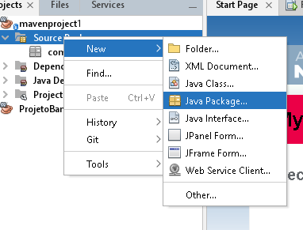

## 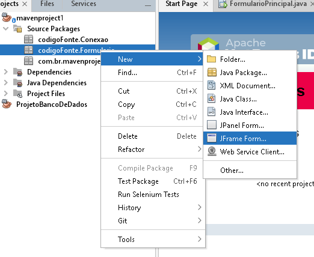

## 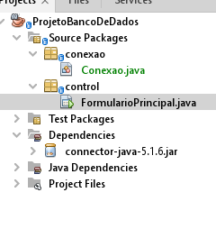

## Passo-a-passo para adicionar o Driver de conexao MySQL

## 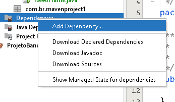
## 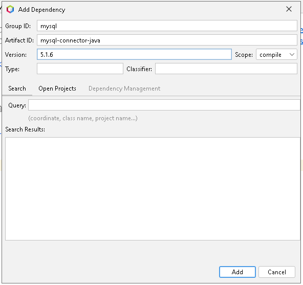
## 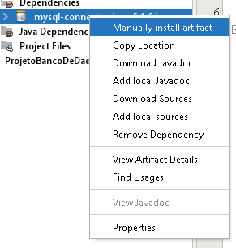
## 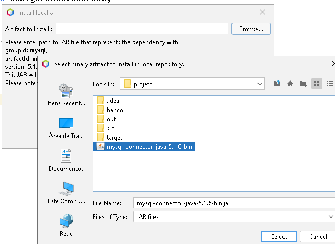

## Estrtura da tabela do banco de dados
## 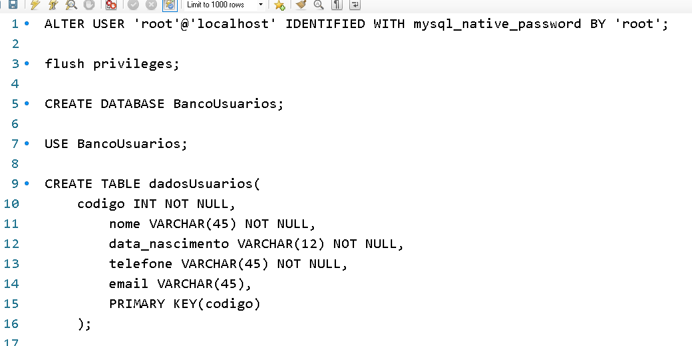

## ATENÇÃO NAS SEGUINTES OBSERVAÇOES

Nesse exemplo o objeto "senha" está sendo setado com a senha vazia, isso irá ocorrer quando o seu banco de dados não conter senha para acessar as databases dele.
## 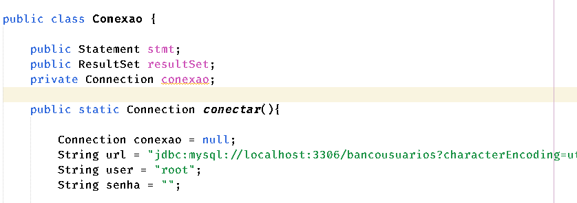

Aqui está com a senha sendo setada como root, mesma senha de conexao do mySQL Workbench
## 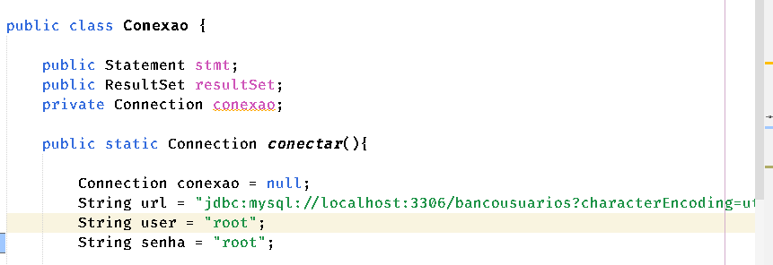
Exemplo:
## 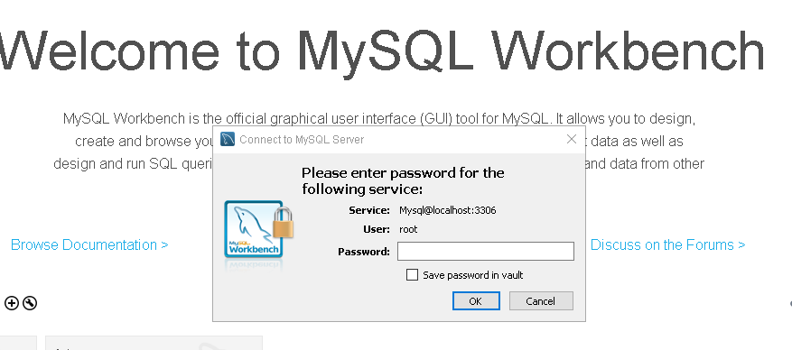

## Quando o driver MySQL ser inserido, e o banco de dados estiver conectado ao executar a classe FormularioPrincipal, sua tela deve seguir as seguintes respostas:

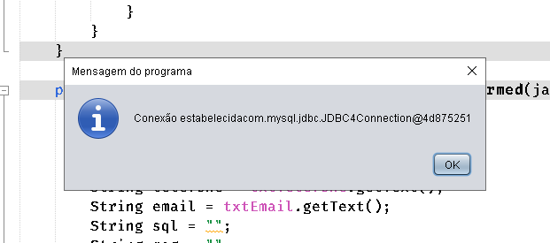
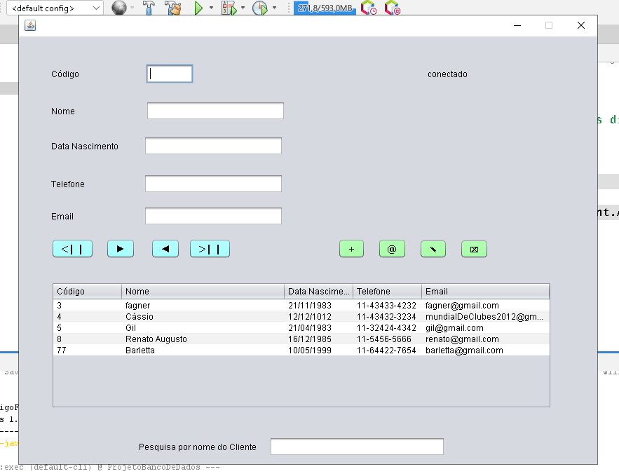

## Caso não esteja conectado o banco de dados, verifique alguns dos possiveis problemas:
    - nome do banco de dados incorreto
    - nome da tabela do banco de dados incorreto
    - Driver de conexao ter sido inserido incorretamente
    - existencia ou ausencia da senha
    - Objeto senha ter sido setado com um nome diferente da senha correta
    - Banco de dados desconectado
    - Versão incorreta do driver de conexao MySQL

# Imagems de como o sistema irá responder em caso de algum erro


Caso apareça esse erro, analise as sugestões ditas acima para uma correção
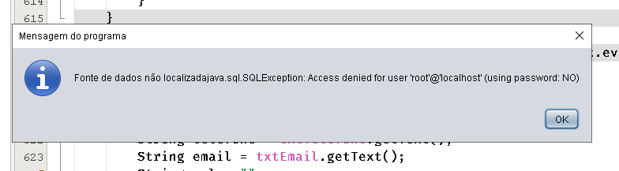
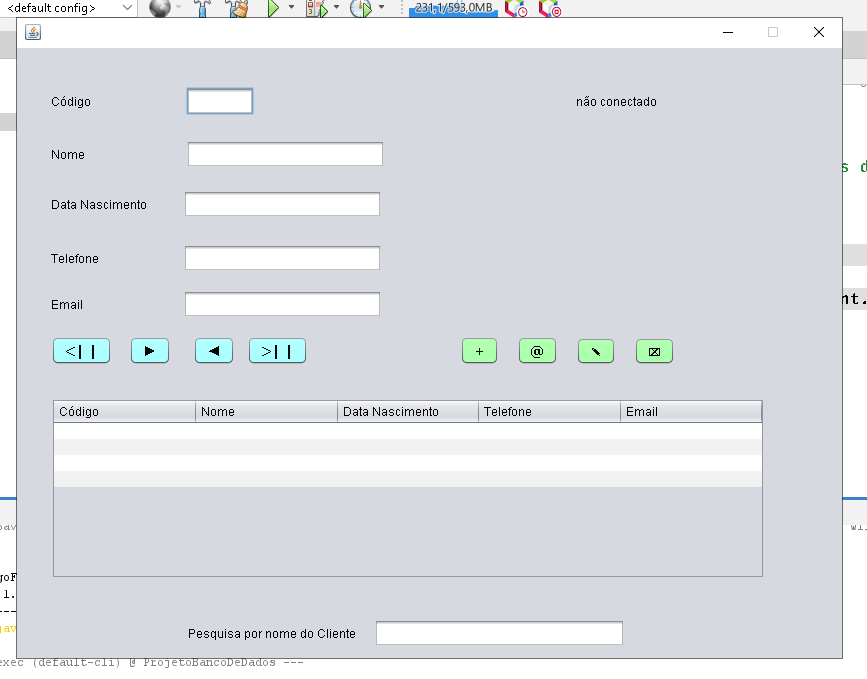


## 🛠️ Construído com

* [Java](https://docs.oracle.com/en/java/) - Linguagem de programação
* [MySQL](https://dev.mysql.com/doc/) - Banco de dados relacional
* [NetBeans 15](https://bits.netbeans.org/15/javadoc/) -  ambiente de desenvolvimento integrado gratuito e de código aberto para desenvolvedores de software nas linguagens Java, JavaScript, HTML5, PHP, C/C++, Groovy, Ruby, entre outras.
## 📌 Versão

Nós usamos [GIT](https://git-scm.com) para controle de versão. 

## ✒️ Autores

* **Felipe Eduardo Garcia** - *Desenvolvimento* - [Myahem-eng](https://github.com/Mayhem-eng)


## 📄 Licença

Este projeto está sob a licença de Felipe Eduardo.
## 🎁 Expressões de gratidão

* Foi incrivel desenolver cada pedaço desse mini projeto 😄
* Novos conhecimentos e experiencias com certeza não faltam ❤️

<br>
Com ❤️ Felipe Eduardo(Mayhem-eng)
